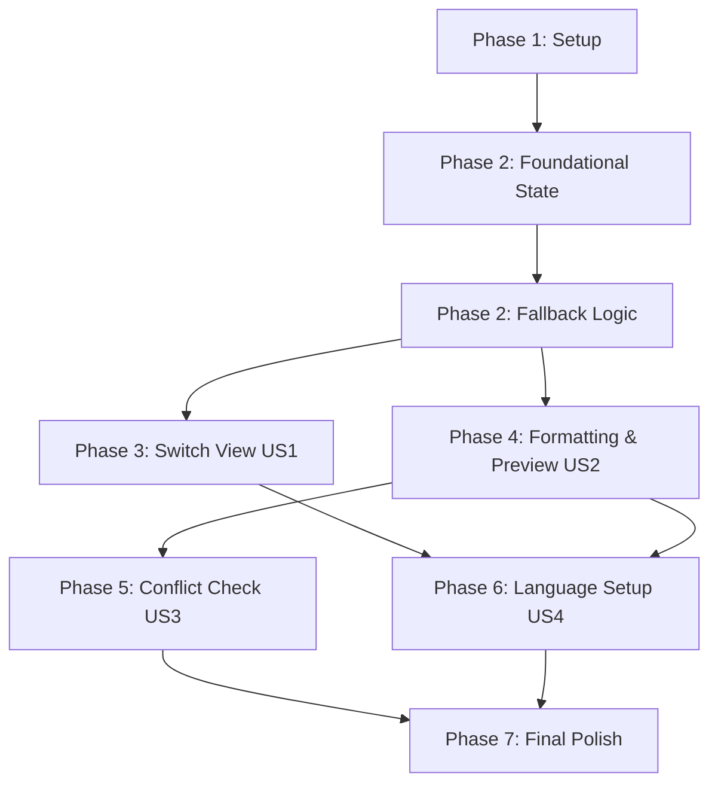

# 任務清單：設定面板 (Settings Panel Tasks)

**輸入**: `/specs/001-settings-panel/` 資料夾下的規格書與設計文件

**前置準備**: [spec.md](./spec.md) (規格書), [plan.md](./plan.md) (技術計畫), [research.md](./research.md) (技術研究)

**組織方式**: 任務依據 User Story 分階段編排，以支援獨立開發、測試與 MVP 增量交付。

---

## 格式說明: `[ID] [P?] [Story] 描述`

- **- [ ]**: Markdown 待辦任務核取方塊
- **[TaskID]**: 循序 Task ID (T001, T002...)
- **[P]**: 可並行開發標記 (無檔案衝突，無相依前置未完成任務)
- **[Story]**: 所屬 User Story 標籤（如 US1, US2, US3, US4）
- 描述中包含具體修改的檔案路徑。

---

## Phase 1: Setup (環境初始化)

**目的**: 開發前的環境對齊與驗證引導。

- [x] T001 閱讀並熟悉 [quickstart.md](./quickstart.md) 中定義的 5 個手動驗證情境，確保本地 Chrome 擴充功能開發者模式可順利載入 `Extension/` 目錄。

---

## Phase 2: Foundational (基礎資料存取結構)

**目的**: 設定資料模型的讀寫架構，為所有 User Story 的阻礙前置任務。

- [x] T002 初始化設定狀態變數（小數點、千分位、語言），並在 `Extension/popup.js` 載入時，透過 `chrome.storage.sync.get` 讀取並套用安全預設值。
- [x] T003 實作向後相容邏輯：若新設定鍵 `userSettings` 為空但舊 `userLanguage` 存在，則自動將其遷移併寫入 `userSettings.userLanguage` 中。

**檢查點**: 基礎資料存取逻辑就緒，無 console 錯誤。

---

## Phase 3: User Story 1 - 設定按鈕與介面切換 (Priority: P1) 🎯 MVP

**目標**: 讓使用者能在換算主畫面與設定畫面之間自由切換。

**獨立測試**: 開啟 popup，點擊右上角設定按鈕切換至設定畫面；點擊返回按鈕能正確切回主畫面。

- [x] T004 [P] [US1] 修改 `Extension/popup.html`，在標頭區塊新增設定按鈕（齒輪圖示），並在主視窗內新增設定面板容器 `#settings-view` 及返回按鈕。
- [x] T005 [P] [US1] 在 `Extension/styles.css` 中為設定按鈕、返回按鈕及 `#settings-view` 面板編寫深色主題樣式，確保切換無閃爍、符合 380x480 尺寸限制。
- [x] T006 [US1] 在 `Extension/popup.js` 中綁定設定與返回按鈕的點擊事件，控制主容器與設定面板之顯示/隱藏（`display: none/block`）。

**檢查點**: 點擊設定與返回按鈕切換流暢，版面大小維持 380x480，無溢出。

---

## Phase 4: User Story 2 - 小數點與千分位格式自訂與即時預覽 (Priority: P1)

**目標**: 讓使用者自訂小數點與千分位分隔符，提供預覽並將格式套用至主畫面金額中。

**獨立測試**: 切換不同符號組合，預覽區即時變更為對應樣式，且主畫面貨幣金額顯示同步變更。

- [x] T007 [P] [US2] 修改 `Extension/popup.html`，在設定面板新增小數點與千分位下拉選擇選單，並新增預覽文字容器 `#format-preview`。
- [x] T008 [P] [US2] 在 `Extension/styles.css` 中美化下拉選單樣式，重用現有 CSS 變數。
- [x] T009 [US2] 在 `Extension/popup.js` 中新增客製化格式化函數 `formatCustomNumber(value, decimalSep, thousandsSep)` 與預覽更新邏輯，預設載入 `12345.67`。
- [x] T010 [US2] 修改 `Extension/popup.js` 中 `formatConversionResult` 與 `formatUserInput` 邏輯，套用使用者選定的小數點與千分位格式（取代寫死的 `,` 與 `.`）。
- [x] T011 [US2] 修改 `Extension/popup.js` 的 `parseFormattedNumber` 邏輯，移除非當前小數點的其他千分位符號，並將自訂小數點字元替換為 `.`，以正常執行 parseFloat。
- [x] T012 [US2] 更新 `Extension/popup.js` 的 `handleAmountInput` 與鍵盤事件驗證（`handleAmountKeydown`），使其在輸入期間支援自訂小數點字元的輸入與算式解析。
- [x] T013 [US2] 在 `Extension/popup.js` 綁定下拉選單的變更事件，每次變更即時寫入 `chrome.storage.sync`。

**檢查點**: 隨意設定小數點與千分位，預覽值即時更新且主畫面換算金額完美渲染。

---

## Phase 5: User Story 3 - 格式衝突自動調整防呆 (Priority: P2)

**目標**: 聯動變更相同的小數點與千分位選項，杜絕歧義格式。

**獨立測試**: 將小數點設為逗號，若此時千分位也是逗號，千分位應自動跳轉為點。

- [x] T014 [US3] 在 `Extension/popup.js` 的下拉選單變更事件中加入衝突檢測邏輯，一旦偵測到兩者相同，自動將另一選項更換為相異之備選符號。

**檢查點**: 任何情況下小數點與千分位皆不可能被同時選為相同符號。

---

## Phase 6: User Story 4 - 介面語言變更與持久化 (Priority: P2)

**目標**: 切換介面語言為英文、繁中、簡中，並即時更新所有介面文本。

**獨立測試**: 選擇繁體中文，介面全數翻譯；重新開啟 popup，維持繁體中文。

- [x] T015 [P] [US4] 在 `Extension/popup.html` 的設定面板中新增語言選擇下拉選單。
- [x] T016 [US4] 擴充 `Extension/popup.js` 中的 `translations` 物件，補齊設定面板所需之所有新增欄位名稱與選項的英文、繁中、簡中對應翻譯。
- [x] T017 [US4] 在 `Extension/popup.js` 中撰寫 `applyLanguage(lang)` 函數，遍歷 DOM 節點更新所有具有翻譯屬性（如 `data-i18n`）的文字內容。
- [x] T018 [US4] 綁定語言下拉選單變更事件，即時呼叫 `applyLanguage` 並寫入 `chrome.storage.sync`。

**檢查點**: 切換語言即時變更且不影響貨幣對應名稱與快取行為。

---

## Phase 7: Polish & Cross-Cutting Concerns (打磨與收尾)

**目的**: 程式碼清理與最終人工驗收。

- [x] T019 對 `Extension/` 目錄下的 js、css、html 檔案進行整理，移除調試用的 console 日誌。
- [ ] T020 依據 [quickstart.md](./quickstart.md) 的指南，逐步完成所有 5 個手動驗證情境，確保核心拖曳排序、快取與計算皆 100% 穩定。

---

## 相依關係與執行順序 (Dependencies)

*   **Setup / Foundation (Phase 1-2)**: 必須優先完成，否則狀態變數無法被其他 User Story 引用。
*   **並行機會 (Parallel)**:
    *   T004 (HTML 結構) 與 T005 (CSS 樣式) 可並行開發。
    *   T007 (預覽 HTML) 與 T008 (預覽 CSS) 可並行開發。
    *   在基礎架構完成後，User Story 1 (切換面板) 與 User Story 2 (數字格式化) 在邏輯上可分配給不同人並行實作，最後再進行整合。

---

## 實作策略 (Implementation Strategy)

### MVP 優先 (User Story 1 & 2)

1.  完成 **Phase 1 & 2** (設定基礎讀寫)。
2.  完成 **Phase 3** (User Story 1 - 齒輪按鈕與切換設定檢視)。這是 MVP 的基礎入口骨架。
3.  實作 **Phase 4** 的關鍵核心：`formatCustomNumber`，完成預覽更新與 Blur 時主畫面金額套用自訂分隔符。
4.  **暫停並驗收**：開啟 Unpacked extension 驗收切換與金額分隔符自訂是否正常，發布 MVP 階段版本。
5.  接續開發 **Phase 5 & 6** (防呆與語言選擇) 進行功能演進。
